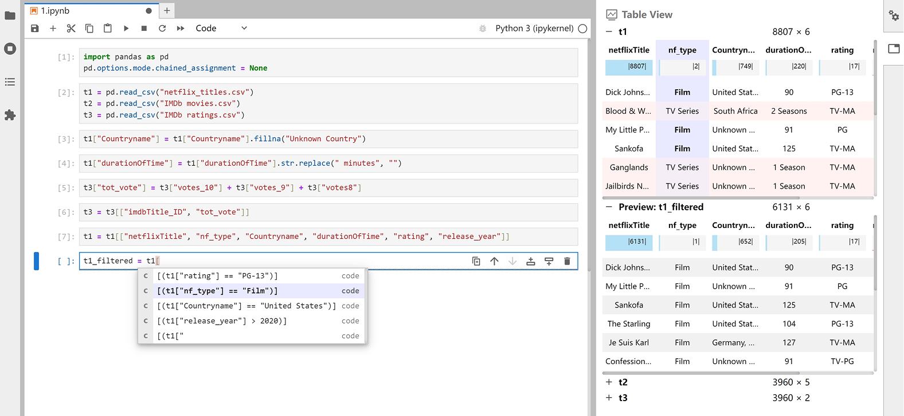
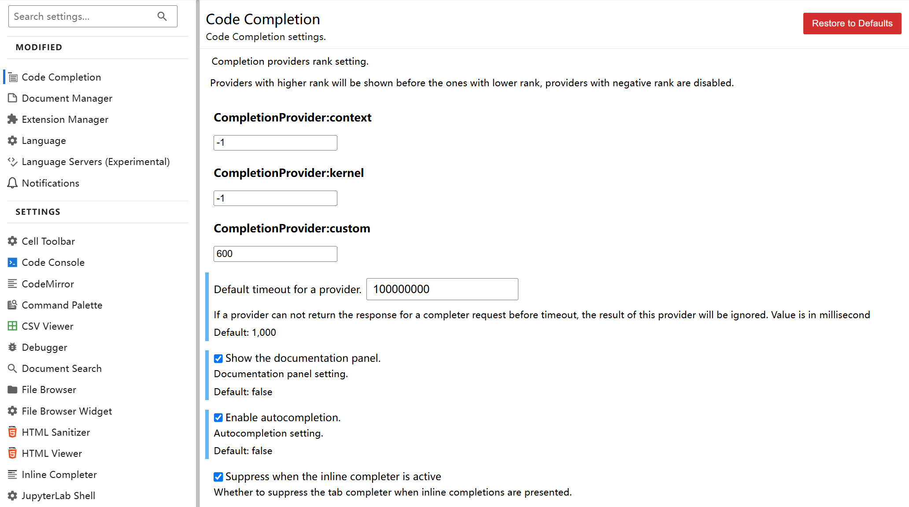
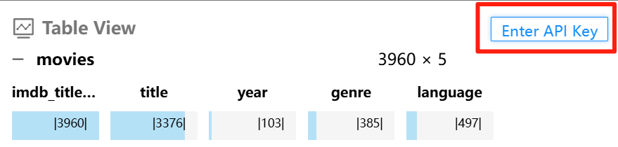

# Xavier

<p align="center">
  <a href="https://pypi.org/project/idgxavier/">
    
  </a>
  <a href="https://arxiv.org/abs/2503.02639">
    
  </a>
    <a href="https://dl.acm.org/doi/10.1145/3706598.3714239">
      
  </a>
  <a href="https://youtu.be/KTnCHSv1heI?feature=shared">
    
  </a>
</p>


This is the source code of our CHI'25 paper <a href="https://dl.acm.org/doi/10.1145/3706598.3714239">"Xavier: Toward Better Coding Assistance in Authoring Tabular Data Wrangling Scripts"</a>. Xavier is a JupyterLab extension designed to enhance data wrangling script authoring. Xavier maintains users’ awareness of data contexts while providing data-aware code suggestions. It automatically highlights the most relevant data based on the user's code, integrates both code and data contexts for more accurate suggestions, and instantly previews data transformation results for easy verification.

To install Xavier:

```bash
pip install -U idgxavier
```



## Usage

1. Register Groq API key from [this link](https://console.groq.com/). The API key starts with `gsk_`. We recommend Groq because it is free and has a high response speed.

2. After the installation, you can set up the jupyter lab environment by running the following command: 

```bash
# At the root directory of the project
cd demo
jupyter lab
```

3. Change the jupyterlab settings as follows:

```
CompletionProvider:context = -1 (Disable default code completion)
CompletionProvider:kernel = -1 (Disable default code completion)
CompletionProvider:custom = 600 (Enable Xavier code completion)
Default timeout for a provider: 100000000 (Set enough timeout for Xavier code completion)
Enable autocompletion: true (Code completion is automatically triggered when typing, instead of pressing Tab to trigger)
```



Remember to restart JupyterLab after changing the settings.

```bash
cd demo
jupyter lab
```

4. You will see the Xavier extension in the right sidebar. You can click the "Xavier" button to open the Xavier panel. Click the "Enter API Key" button to input your Groq API key.




5. Done! You can start by familiarizing yourself with Xavier's key usage through the [demo/Warm-up Task for Xavier.ipynb](./demo/Warm-up%20Task%20for%20Xavier.ipynb). After getting comfortable with these controls, you can move on to the main demo with the Netflix dataset ([demo/demo.ipynb](./demo/demo.ipynb)).

## Project Structure

- `frontend/`: The source code of Xavier.
- `demo/`: A demo JupyterLab project to demonstrate how to use Xavier.


## Development

### Todo

- Store API Key in the local storage instead of the frontend.
- Fix some bugs of string manipulation in the completion
- Support other LLMs (Currently only supports Groq llama3-70b-8192)
- Speed up the completion process


### Environment for reference

- Hardware
  - Processor: 12th Gen Intel(R) Core(TM) i7-12700H   2.30 GHz
  - RAM: 16 GB
  - Operator System: Windows 11 64-bit, based on x64 processor
- Software
  - Jupyter Lab version: >=4.0.0 (e.g. 4.2.5)
  - Pandas: >=2.2 (e.g. 2.2.3)
  - Typeguard: <4 (e.g. 3.0.2)
  - (Optional) Conda version: >23.7

### Installation

1. If you are using Windows, please follow [this instruction](https://learn.microsoft.com/en-us/windows/apps/get-started/enable-your-device-for-development) to enable the developer mode.
2. Install required packages. It is recommended to use a virtual environment like conda.

```bash

# At the root directory of the project
# Create a new environment named "xavier_env" and install required packages.
conda create -n xavier_env python=3.10.13 typeguard=3.0.2
activate xavier_env

cd frontend

# Set suitable registry if you encounter network issues. For instance in China, you can use the following commands:
# npm config set registry https://registry.npm.taobao.org/
# yarn config set registry https://registry.npm.taobao.org/
# pip config set global.index-url https://pypi.tuna.tsinghua.edu.cn/simple

# Install package in development mode. Note that "pip" should be used instead of "conda" for installing the packages. You will see "idgxavier" if you run "pip list" command.
pip install -e .
# Install jupyterlab and pandas. pip will install the latest version of jupyterlab (>=4.0.0) and pandas (>=2.2). You can run `jupyter --version` or `pip list` to check the version.
pip install jupyterlab pandas
# Link your development version of the extension with JupyterLab
jupyter labextension develop . --overwrite
# Rebuild extension Typescript source after making changes
jlpm run build

# - Note: If you encounter any error during installation and want to reinstall the packages, remember to remove these files in the `frontend` directory first:
#   - .yarn/*
#   - node_modules/*
#   - lib/*
#   - idgxavier/labextension/*
#   - idgxavier/_version.py
#   - yarn.lock
#   - tsconfig.tsbuildinfo

```

3. After the installation, you can run the frontend by running the following command:

```bash

# At the root directory of the project
cd demo
# If you have not activated the environment:
activate xavier_env
jupyter lab

```

4. Register Groq API key from [this link](https://console.groq.com/). The API key starts with `gsk_`. We recommend Groq because it is free and has a high response speed.


### How to uninstall Xavier

```sh
pip uninstall idgxavier

# In frontend directory
cd frontend
rmdir /s /q node_modules
rmdir /s /q .yarn
rmdir /s /q lib
rmdir /s /q idgxavier\labextension
del idgxavier\_version.py
del yarn.lock
del tsconfig.tsbuildinfo

# Clear Python cache
rmdir /s /q idgxavier\__pycache__
rmdir /s /q idgxavier\server\__pycache__
rmdir /s /q idgxavier\server\lexAnalysis\__pycache__
rmdir /s /q idgxavier\server\prompt\__pycache__
rmdir /s /q idgxavier\server\server\__pycache__
rmdir /s /q idgxavier\server\trivial\__pycache__

jupyter lab clean
```


<!-- groq flask flask-cors python-dotenv

# Run the server:
cd backend
python server_main.py -->


## Citation

If you use Xavier in your research, please cite our paper:

```bibtex

@inproceedings{xavier,
  author = {Zhou, Yunfan and Cai, Xiwen and Shi, Qiming and Huang, Yanwei and Li, Haotian and Qu, Huamin and Weng, Di and Wu, Yingcai},
  title = {Xavier: Toward Better Coding Assistance in Authoring Tabular Data Wrangling Scripts},
  year = {2025},
  publisher = {Association for Computing Machinery},
  address = {New York, NY, USA},
  doi = {10.1145/3706598.3714239},
  booktitle = {Proceedings of the CHI Conference on Human Factors in Computing Systems},
  articleno = {850},
  numpages = {16}
}

```